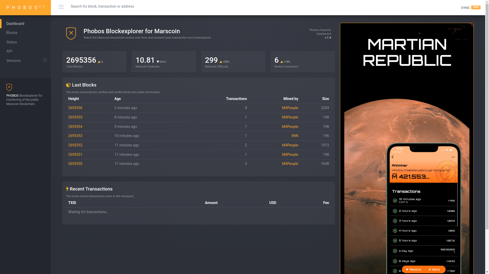

<p align="center">
  <a href="https://github.com/marscoin/phobos" title="Phobos">
    </img>
  </a>
</p>

# *Phobos*

*Phobos* is an open-source Marscoin blockchain explorer with complete REST and websocket APIs based on the original Litesight explorer.
Phobos runs in NodeJS, uses AngularJS for the front-end and LevelDB for storage. It's an older version of nodejs for now, pull requests welcome to move it closer to the latest nodejs.

For a live version see [Marscoin explorer's homepage](http://phobos.marscoin.org/).

## Prerequisites

* **Node.js v4.9** - Use nvm to install. Pull requests welcome.

* **NPM** - Node.js package manager, should be automatically installed when you get Node.js.


## Quick Install
  Check the Prerequisites section above before installing.

  To install litesight, clone the main repository:

    $ git clone https://github.com/marscoin/phobos.git && cd Marssight

  Install dependencies:

    $ npm install
    
  Run the main application:

    $ ./launch.sh 

  You might run into some error messages depending on your setup. Typical issues might involve rebuilding dependencies node-gyp@3.8 might help. If a package is missing check the package.json and try to get the correct version. Feel free to send an emailt to info@marscoin.org if you need help.
    
  Then open a browser and go to:

    http://localhost:5005

  Please note that the app will need to sync its internal database
  with the blockchain state, which may take some time. You can check
  sync progress from within the web interface. More details about that process
  on [litesight-api README](https://github.com/marscoin/Litesight-api/blob/master/README.md). 
  
  
## Development

To compile and minify the web application's assets:

```
$ npm install grunt-cli
$ grunt compile
```

There is a convenient Gruntfile.js for automation during editing the code

```
$ grunt
```

curl https://pyenv.run | bash
pyenv install 2.7.18
pyenv global 2.7.18

There are two libraries this project depends on - Litesight-API and Litecore. They are part of this repository but may need recompiling. Follow the instructions of GPT when running ./launch.sh. Also make sure your local marscoind node has a full transaction index via the configuration option txindex=1.

## License
(The MIT License)

Permission is hereby granted, free of charge, to any person obtaining
a copy of this software and associated documentation files (the
'Software'), to deal in the Software without restriction, including
without limitation the rights to use, copy, modify, merge, publish,
distribute, sublicense, and/or sell copies of the Software, and to
permit persons to whom the Software is furnished to do so, subject to
the following conditions:

The above copyright notice and this permission notice shall be
included in all copies or substantial portions of the Software.

THE SOFTWARE IS PROVIDED 'AS IS', WITHOUT WARRANTY OF ANY KIND,
EXPRESS OR IMPLIED, INCLUDING BUT NOT LIMITED TO THE WARRANTIES OF
MERCHANTABILITY, FITNESS FOR A PARTICULAR PURPOSE AND NONINFRINGEMENT.
IN NO EVENT SHALL THE AUTHORS OR COPYRIGHT HOLDERS BE LIABLE FOR ANY
CLAIM, DAMAGES OR OTHER LIABILITY, WHETHER IN AN ACTION OF CONTRACT,
TORT OR OTHERWISE, ARISING FROM, OUT OF OR IN CONNECTION WITH THE
SOFTWARE OR THE USE OR OTHER DEALINGS IN THE SOFTWARE.
